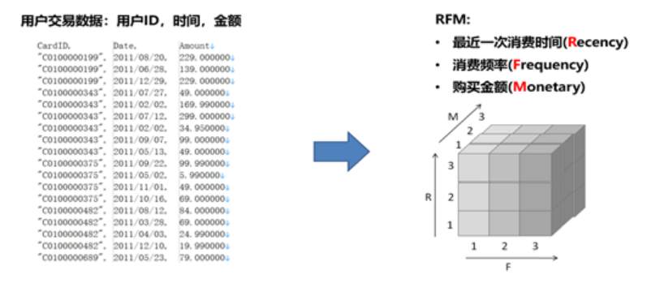
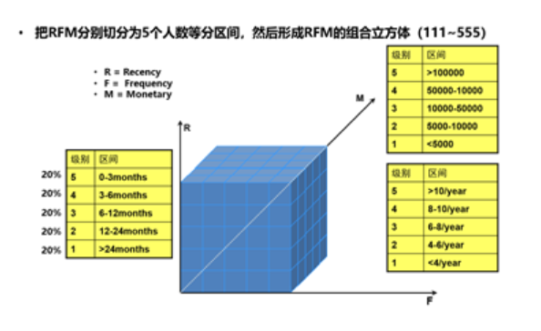
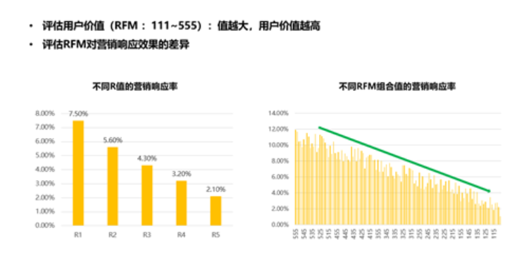

# 利用RFM构造营销响应模型---RFM特征提取--任务描述
- (1)什么是RFM
    RFM是CRM（客户关系管理）领域中广泛使用的一个评估用户价值的指标。CRM客户数据库中有3个神奇的要素，这3个要素构成了CRM数据分析最好的指标：
        最近一次购买时间 (Recency)
        购买频率 (Frequency)
        购买金额 (Monetary)
    
    上图左边是用户的消费行为数据，它包含了三个字段：用户ID，消费时间，消费金额。右边是基于用户消费行为数据提取出来的三个特征：R，F，M。
    RFM其实并不是只适用于CRM领域。我们把上图左边的这种格式的数据叫做“交易数据（Transactional Data）”，在很多行业，这样的交易数据很常见，它们都可以使用RFM的方法来提取特征，例如：
        店铺的用户购买订单：用户ID，下单时间，下单金额
        银行的客户交易流水：用户ID，交易时间，交易金额
        用户的上网日志：用户ID，登陆时间，停留时长
        用户使用APP的日志：用户ID，打开时间，使用时长
    所以我们看到：RFM就是用来衡量用户行为特征最重要的一种方法。

- (2)RFM特征离散化
    原始提取出来的RFM特征都是连续型的数值，RFM分析的时候我们习惯把它们进行离散化（前面我们有学习过，又叫分箱），常见的离散化方法是使用之前介绍过的等深分段的方法，把RFM切分为人数相同的5个等分，即R取值{1,2,3,4,5}，F取值{1,2,3,4,5}，M取值{1,2,3,4,5}，这样把RFM组合在一起可以得到一个新的特征取值是{111,112,113...551,552,553,554,555} 共计555=125个值，这又叫RFM立方体，125个值就是立方体中的125个块。
    

- (3)RFM特征提取示例
    提取用户的RFM的特征过程很简单：
        针对用户ID进行汇总（GroupBy）
            Recency就是用户消费日期的最大值Max(Date)，一般我们还会用当前日期减去它转换为距离现在的间隔时长（天数）
            Frequency就是用户的消费记录数Count(*)
            Monetary就是用户消费额的总和Sum(Amount)

- (4)RFM应用
    RFM是反映用户行为特征最重要的三个指标，我们针对每个用户提取了他们的RFM特征之后如何用呢？主要有两个应用场景：
        以RFM组合值（111-555）作为用户的价值衡量，值越大用户价值越大。
        以R，F，M作为特征变量去构建一个预测模型，预测用户对营销活动的响应概率。
    